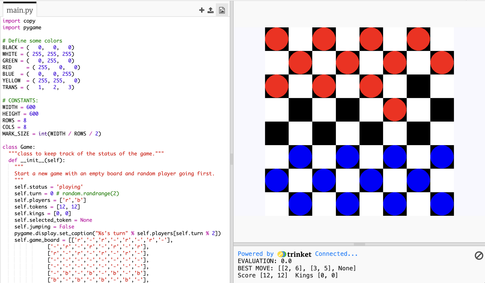

## Checkers AI
In Fall 2020, I took Discrete Math and, for the final project, implemented an AI checkers opponent using the Minimax algorithm and alpha-beta pruning to improve its efficiency with two of my friends. We created documentation to explain the theory and mathematics behind the implementation in a clean, concise [website](https://sites.google.com/view/lazyy/home?authuser=0) with a [web browser plugin to facilitate realtime gameplay](https://sites.google.com/view/lazyy/play?authuser=0).



  


